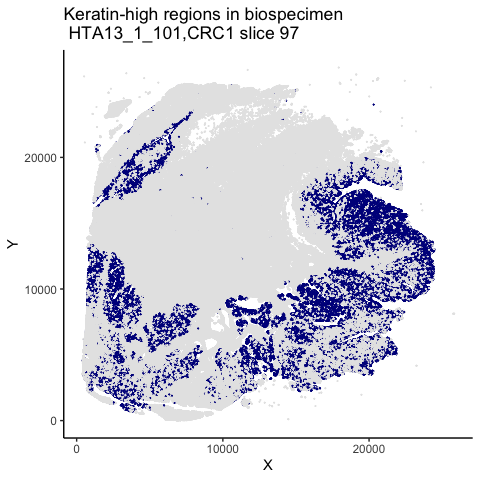

# 1. Introduction & Overview 

[HTAN](https://humantumoratlas.org/) is a National Cancer Institute (NCI)-funded Cancer MoonshotSM initiative to construct 3-dimensional atlases of the dynamic cellular, morphological, and molecular features of human cancers as they evolve from precancerous lesions to advanced disease. [Cell April 2020](https://www.sciencedirect.com/science/article/pii/S0092867420303469) 

Many HTAN Research Centers employ highly-multiplexed imaging to gain understanding of cellular and molecular processes at work in the tumor microenvironment.  The study[Multiplexed 3D atlas of state transitions and immune interaction in colorectal cancer](https://www.cell.com/cell/fulltext/S0092-8674(22)01571-9), Lin et al 2023, uses multiplexed whole-slide imaging analysis to characterize intermixed and graded morphological and molecular features in human colorectal cancer samples, highlighting large-scale cancer-characteristic structural features.

This notebook shows one example of how these data can be accessed and analyzed using R programming software.

### 1.1 Goal

This example notebook illustrates how to make use of HTAN Google BigQuery tables that contain information on cellular locations and the estimated expression of key marker protein based multiplexed imaging followed by cell segmentation. 

### 1.2 Inputs, Outputs, & Data 

The originating data can be found on the [HTAN Data Portal](https://data.humantumoratlas.org/), and the data tables are on the [Cancer Gateway in the Cloud](https://isb-cgc.appspot.com/).


### 1.3 Notes

The tables correspond to HTAN Data Version 3.

# 2. Environment & Library Setup

```r
suppressMessages(library(tidyverse))
suppressMessages(library(bigrquery))
suppressMessages(library(knitr))
suppressMessages(library(rdist))
suppressMessages(library(dbscan))
```

# 3. Google Authentication

Running the BigQuery cells in this notebook requires a Google Cloud Project, instructions for creating a project can be found in the [Google Documentation](https://cloud.google.com/resource-manager/docs/creating-managing-projects#console). The instance needs to be authorized to bill the project for queries. For more information on getting started in the cloud see 'Quick Start Guide to ISB-CGC' and alternative authentication methods can be found in the [Google Documentation](https://cloud.google.com/resource-manager/docs/creating-managing-projects#console).


```r
billing <- 'my-project' # Insert your project ID in the ''
if (billing == 'my-projectr') {
  print('Please update the project number with your Google Cloud Project')
}
```

# 4. Explore Spatial Cellular and Molecular Relationsips

We will focus on sample CRC1, tissue section 97, described in the manuscript in detail (see e.g. Figure 1C). This section is HTAN biospecimen `HTA13_1_101`. An excellent interactive introduction to multiplex imaging data for this biospecimen is provided on InsertSiteHere.  The data for this and the other CRC1 tissue sections is found in BigQuery table `htan-dcc.ISB_CGC_r3.ImagingLevel4_crc_mask`, which contains estimated marker intensity after segmentation using three kinds of masks. Here we will use the mask "cellRingMask". The tables also contain data on location of geometry of segmented regions and here we will use the centroids `X_centroid` and `Y_centroid`.

### 4.1 Investigate cell locations 

We begin by querying for the coordinates of the centroids for the relevant tissue slice `HTA13_1_101`.

```r
if (FALSE){
sql <- "SELECT X_centroid, Y_centroid FROM `htan-dcc.ISB_CGC_r3.ImagingLevel4_crc_mask`where HTAN_Biospecimen_ID='HTA13_1_101'"
tb <- bq_project_query(billing, sql)
df <- bq_table_download(tb)
}

df <- read_csv("/Users/vthorsson/HTAN/HMS/coords.csv",show_col_types = FALSE)
df <- df %>% rename(X="X_centroid",Y="Y_centroid")
```
This gives a table as an R data frame. One row per cell, with X and Y centroid coordinates as columns.

How many cells are there? 

```r
nrow(df)
```

```
## [1] 1287131
```
Now let's do a scatter plot of the centroids. (This may take a few seconds as there are a lot of cells!)


OK so now we see all the cell locations, but the appearance is not visibly consistent with manuscript images (Figure 1C, e.g).

This can be improved with a horizontal flip:


```r
df <- df %>% mutate(Y_flipped=-Y+min(Y)+max(Y))
```


This looks better. Let's use these Y coordinates from now on.

### 4.2 Which areas are tumor rich?

Now we augment the query to include the marker for keratin: `Keratin_570_cellRingMask`.


```r
if (FALSE){
sql <- "SELECT X_centroid, Y_centroid, Keratin_570_cellRingMask FROM `htan-dcc.ISB_CGC_r3.ImagingLevel4_crc_mask`where HTAN_Biospecimen_ID='HTA13_1_101'"
tb <- bq_project_query(billing, sql)
df <- bq_table_download(tb)
}

df <- read_csv("/Users/vthorsson/HTAN/HMS/coords_keratin.csv",show_col_types = FALSE)
df <- df %>% rename(Keratin=Keratin_570_cellRingMask,X=X_centroid,Y=Y_centroid)
df <- df %>% mutate(Y_flipped=-Y+min(Y)+max(Y)) %>% select(-Y) %>% rename(Y=Y_flipped)  
```

What is the distribution of Keratin values over all cells?

```r
ggplot(df,aes(Keratin)) + geom_histogram(binwidth = 1000) +
  ggtitle("Distribution of Keratin Values") +
  theme_classic()
```


Let's threshold the Keratin as being positive above the 3rd quartile.

```r
third.quartile <- summary(df$Keratin)[["3rd Qu."]]
df <- df %>% mutate(Keratin_status = c("Neg","Pos")[(Keratin > third.quartile)+1])
```
This has generated a new categorical variable, `Keratin_status`, designated as Low or High for every cell. A more sophisticated thresholding scheme is employed in the manuscript and described in the coresponding methods section.

Where are the Keratin-high cells on the image?


This is consistent with keratin-rich regions described in the manuscript (see manuscript Figure 1C).

### 4.3 Correlations
The manuscript describes how spatial correlation functions are calculated for a pair of cell markers. Examining this correlation as a function of distance yields estimates of the spatial extent of cancer-associated cellular structures. Distance scales with cellular neighborhoods expressed as number of neighbors. As an example we calculate keratin correlation for 10 nearest neighbhors (in the manuscript methods C_AB(r), with A=Keratin,B=Keratin, and r=10)

As the pairwise distance calculation is resource intenstive for the entire collection of 1.2 million cells, we limit the illustration to square-shaped subregion.

Definition of subregion 

```r
df_small <- df %>% filter(X>5000) %>% filter(X<7500) %>% filter(Y>5000) %>% filter(Y<7500)
```
There are 27963 cells within this region. 

Keratin high low values in the region


Keratin values in the region


The first step is to identify the 10 nearest neighbors of each cell. We calculate all pairwise distances and then find the (row) indices of the nearest neighbors. 

```r
j <- rdist::pdist(df_small[,c("X","Y")])
jj <- as.dist(j)
b <- dbscan::kNN(jj,10)
```


10 nearest neighbors of the first data point, and the keratin values thereof, and their mean

Now we can march through the cells, get the neighbors of each, and calculate the mean value of the neighbors, and that value to our data frame.

```r
collect <- numeric()
for (index in 1:nrow(df_small) ){
  ##Mean of Neighbors
  meanz <- df_small[b$id[index,],"Keratin"] %>% pluck("Keratin") %>% mean()
  collect <- c(collect,meanz)
}
df_small <- df_small %>% add_column(Keratin_10NN_mean=collect)
```


```r
df_small %>% summarize(cor(Keratin,Keratin_10NN_mean))
```

```
## # A tibble: 1 × 1
##   `cor(Keratin, Keratin_10NN_mean)`
##                               <dbl>
## 1                             0.806
```
The correlation is fairly high and in line with results shown in the manuscript (Figure 2B).


# 5. Citations and Links

[Cell April 2020](https://www.sciencedirect.com/science/article/pii/S0092867420303469)

[Multiplexed 3D atlas of state transitions and immune interaction in colorectal cancer](https://www.cell.com/cell/fulltext/S0092-8674(22)01571-9)
